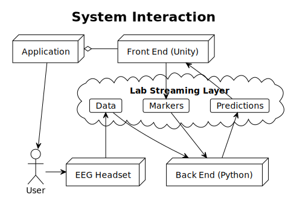

BCI Essentials *(Bessy)* is a software framework facilitating the integration of EEG control schemes for games and other applications. Designed for flexibility and ease of use, it lets you pick out just the parts you need for any given project.

Data processing and classification *(the "back end")* receives data and communicates with the presentation of stimulus and interaction *(the "front end")* through [Lab Streaming Layer](https://labstreaminglayer.org/). Both a front and back end are required to complete a functional system, though any implementation may be used. The *essential* core of the framework itself is the communication protocol and promises imposed by it.

## Back Ends
[BCI Essentials Python](bessy-python)  
*Python library with template scripts*

## Front End Toolkits
[BCI Essentials Unity](bessy-unity)  
*Unity package implementing routines for training and stimulus presentation*

## Site Index: