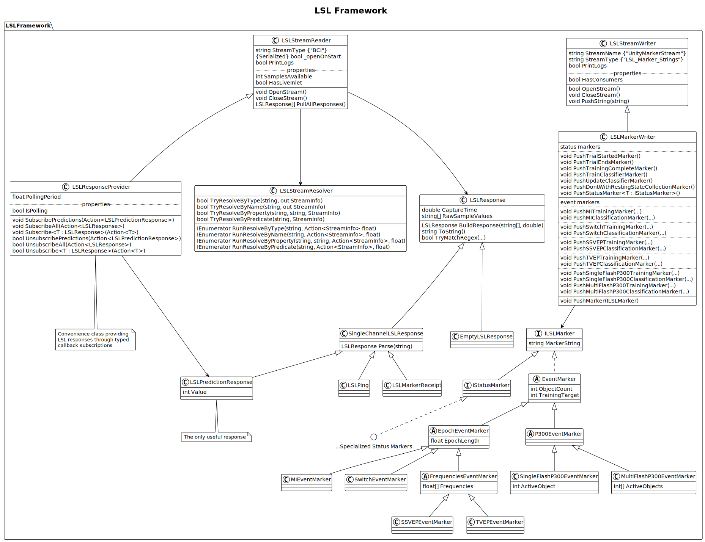

In addition to the provided paradigm controller behaviours, you can use the LSL framework to communicate directly with BCI Essentials python. There are two classes likely to be the most helpful:
- [LSL Marker Writer](./writing-markers.md)
- [LSL Response Provider](./reading-markers.md)

See [Framework](../../framework/).

