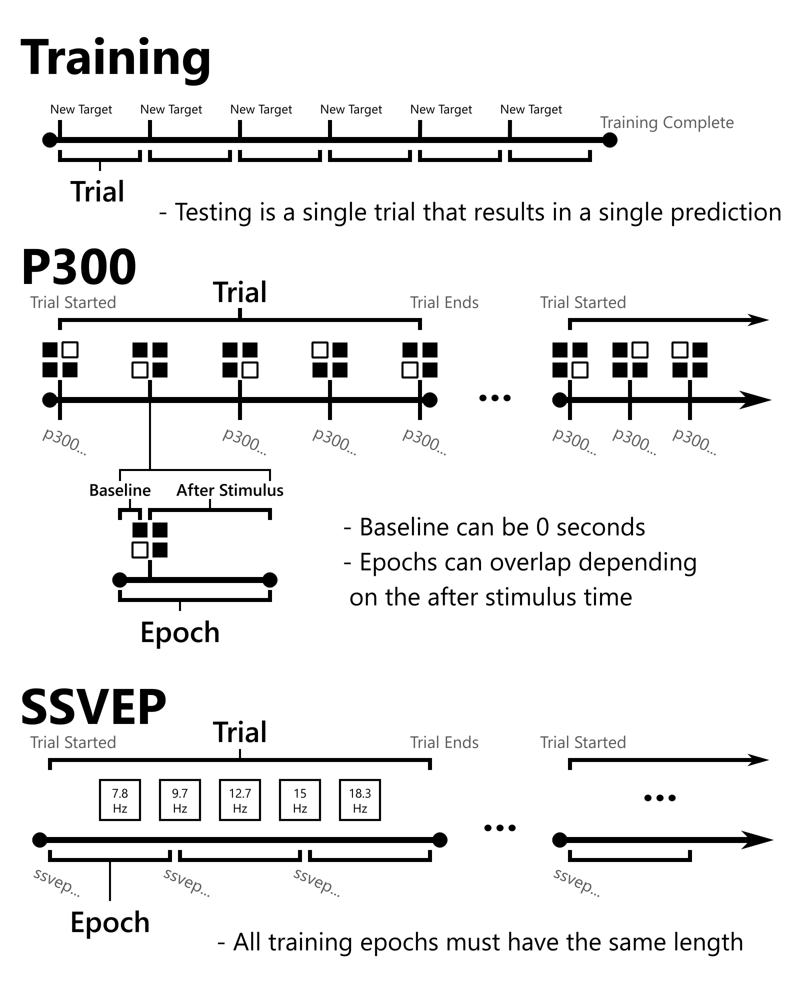

BCI Essentials uses [Lab Streaming Layer (LSL)](https://labstreaminglayer.org/) to interchange time synchronized EEG data, presentation markers, and classification responses. A stream with type: `LSL_Marker_Strings` sends [markers](markers) from the front end. Another with type: `BCI` sends [responses](responses) from the back end. Messages are formatted as comma-delimited strings.

| Stream Type | Content |
| -- | -- |
| `LSL_Marker_Strings` | [markers](markers) |
| `BCI` | [responses](responses) |

## Timeline Definitions

    Epoch
    Data processing window surrounding a period of focus on a target class or object. For discrete stimulus paradigms like P300, an epoch consists of a baseline period followed by an expectation of stimulus response. Paradigms targetting a specific state such as MI and SSVEP define these classed periods arbitrarily in conjunction with user prompting. All training epochs must have the same length.
|
    Trial
    Stimulus sequence or set of epochs with user focus on a particular class or object. Used for both training and classification.
|
    Training
    Sequence of targetted trials targetting different objects or classes providing the data and event markers necessary to build a classifier for live inferences.


